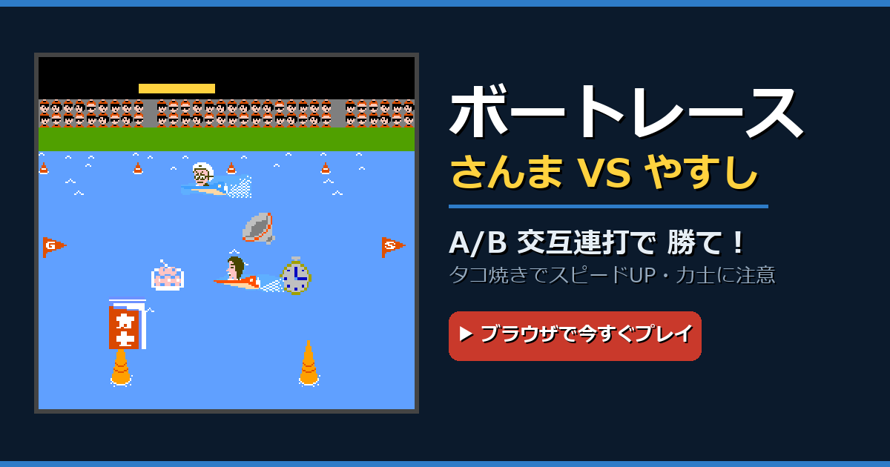

# ボートレース — さんま VS やすし 🚤

ブラウザで遊べる、ファミコン風の **A/B交互連打ボートレース** ミニゲーム。
やすしより先にゴールを目指せ！

**▶ Play: https://hotatecurry.github.io/sanma-boat-race/**



## 遊び方
- **漕ぐ**: `A` / `B` を交互連打（PCキー: `Z`=B, `X`=A）。交互に押すほど加速。
- **レーン移動**: `▲▼`（PC: `↑↓` または `W`/`S`）。A〜Dの4レーンを上下に移動。
- 🐙 **タコ焼き**: 取るとスピードアップ。
- ⏱ **時計**: 取るとやすしが数秒ストップ。
- 🍜 **お邪魔（丼・下駄・木槌）**: 当たると数秒動けない。
- 🔴 **力士（極稀）**: 当たると……！？

## 特徴
- **単一HTMLファイル・外部依存ゼロ**。画像・音源はすべて base64 で埋め込み済みなので、`index.html` を静的ホスティングに置くだけで動きます。
- PC（キーボード）／スマホ（画面ボタン）両対応。
- BGM付き（レース中のみ再生）。

## ビルド（任意・アセットを差し替えたい人向け）
```bash
python build.py    # 画像・音声を index.html に埋め込んで再生成
python gen_og.py   # X用リンクプレビュー og.png を生成
```
必要: Python 3 + Pillow（`pip install pillow`）

## クレジット / 免責
本作は、ファミコン『さんまの名探偵』のボートレースを参考にした **オリジナル実装のファン／パロディ作品** です。原作のコード・画像・音源は一切使用していません。関係各所・権利者とは一切関係ありません。権利上のご懸念があればご連絡ください。

## License
コード: MIT
